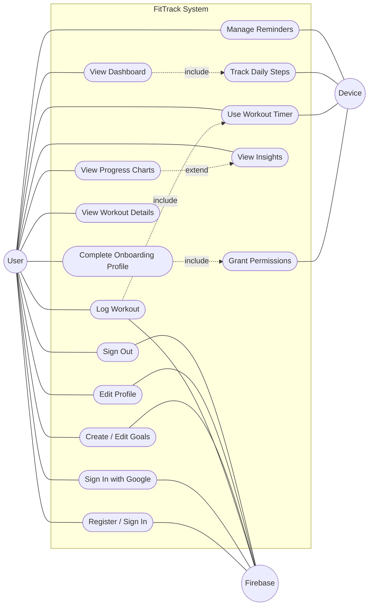
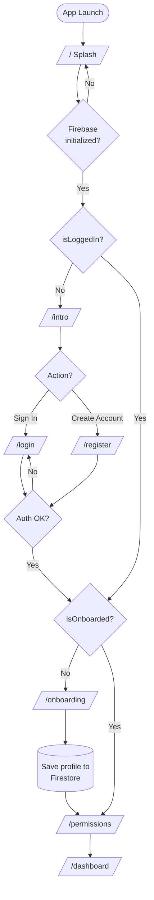
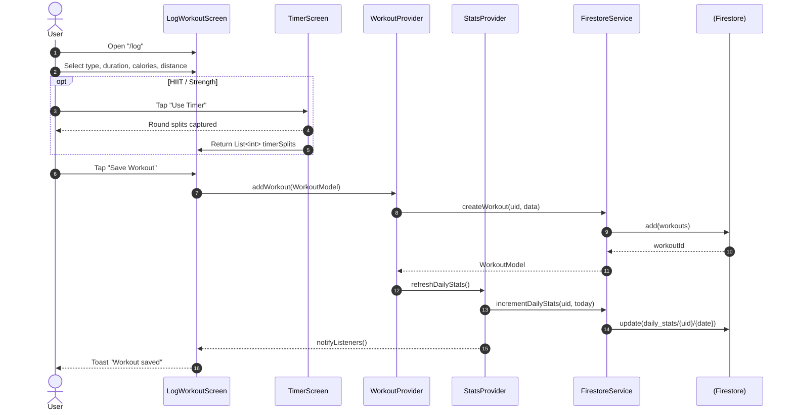
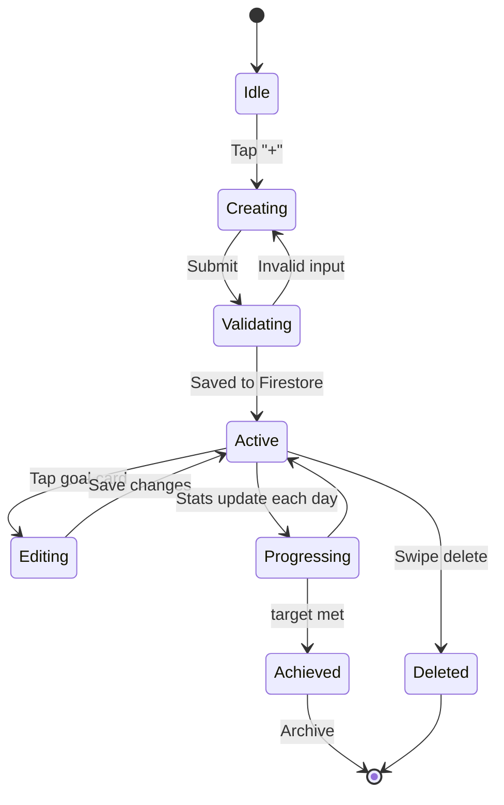
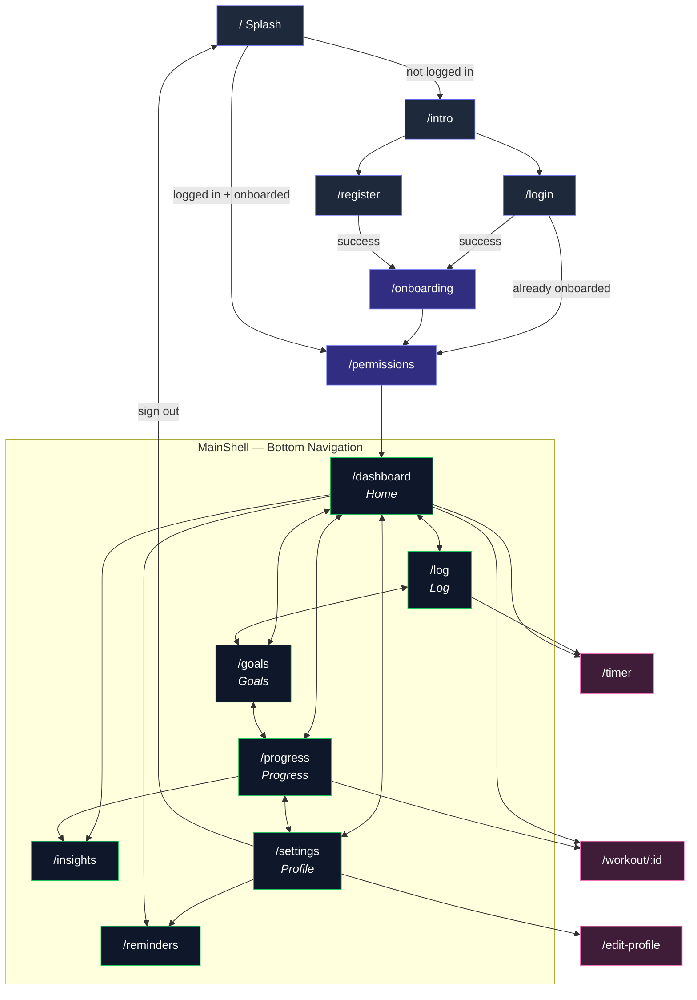

# FitTrack Application — System Design Report

**Project:** FitTrack (Flutter / Firebase fitness tracker)
**Document type:** Technical design report with UML and flow diagrams
**Prepared for:** Engineering, product, and QA stakeholders
**Date:** 20 April 2026
**Source of truth:** `lib/` directory of the `fit_track` repository

---

## Executive Summary

FitTrack is a cross-platform Flutter application that helps users log
workouts, track daily step counts, set fitness goals, and receive local
reminders. The application uses Firebase Authentication and Cloud Firestore
as its primary backend, augmented by on-device services for step counting,
local notifications, and interval timing.

This report documents the application's behaviour from three complementary
angles. Section three presents a UML use case diagram that enumerates every
meaningful user-facing capability. Section four walks through the five
essential runtime flows in the system, using a mix of flowchart, sequence,
and state-machine diagrams to expose both the user journey and the
inter-component collaborations. Section five captures the complete
navigation graph produced by the declarative `GoRouter` configuration in
`lib/utils/routes.dart`, including the redirect rules that enforce
authentication and onboarding invariants.

Together these diagrams give any new engineer the mental model needed to
make safe changes: they show what the app does, how it gets from one state
to another, and which architectural tier owns each responsibility.

---

## 1. Introduction

### 1.1 Purpose

The purpose of this report is to consolidate, in a single document, the
behavioural and navigational design of the FitTrack mobile application. It
is intended to serve three audiences. New contributors can use it as an
orientation map before opening the codebase. Product managers can use it to
confirm that every intended user capability has a home in the design. QA
engineers can use it to derive test scenarios from the use case catalogue
and the flow diagrams.

### 1.2 Scope

The report covers the end-user application surface only: authentication,
onboarding, dashboard, workout logging, goals, progress and insights,
reminders, and profile management. Backend infrastructure (Firestore
security rules, Cloud Functions, CI/CD) and platform-specific build
configuration are out of scope.

### 1.3 Conventions

All diagrams in this report are expressed in Mermaid syntax so that they
render natively in GitHub, VS Code, Obsidian, and most modern Markdown
viewers. Route paths and code identifiers are rendered in fixed width,
for example `/dashboard` or `AuthProvider`. References to screen classes
match the filenames in `lib/screens/`.

---

## 2. System Overview

FitTrack is structured as a conventional Flutter application using the
`provider` package for state management and `go_router` for declarative
navigation. The `main.dart` entry point initialises Firebase and the local
notification service, then mounts a tree of `ChangeNotifierProvider`s and
`ChangeNotifierProxyProvider`s around a `MaterialApp.router`. The proxy
providers ensure that workout, goal, and stats data are automatically
refreshed whenever the authenticated user changes.

Persistence is split across two stores. Cloud Firestore holds the
cross-device data — the user profile, workouts, goals, and aggregated daily
statistics. The on-device SQLite database (via `sqflite`) holds reminders,
which are intentionally device-local. Real-time device signals — step
counts from the `pedometer` plugin and fired notifications from
`flutter_local_notifications` — feed back into the providers so that the
UI stays reactive.

The remainder of this report explores the behaviour this architecture
enables.

---

## 3. Use Case Analysis

### 3.1 Overview

The use case diagram below captures the complete catalogue of capabilities
exposed to the end user, together with the supporting system actors that
make each capability possible. The primary actor is the human **User**.
Two supporting actors stand in for external or platform services: the
**Firebase** actor covers authentication, Firestore reads and writes, and
Google Sign-In federation, while the **Device** actor covers the step
counter, local notification scheduler, timezone resolution, and runtime
permission prompts.

### 3.2 Diagram



### 3.3 Discussion

Several relationships in the diagram merit explicit commentary because
they shape how features compose at runtime. The *Complete Onboarding
Profile* use case includes *Grant Permissions*, which means the first-run
flow is deliberately non-skippable: the router keeps a freshly registered
user pinned inside the onboarding path until both a profile has been saved
and notification and activity-recognition permissions have been addressed.
The *Log Workout* use case includes *Use Workout Timer* because any
workout that involves interval rounds re-uses the timer screen and
deposits its captured splits back into the resulting workout record. The
inverse relationship, *View Progress Charts* extended by *View Insights*,
reflects the fact that Insights is an optional analytical deep-dive rather
than a mandatory step on the progress path — a user who only wants the
weekly summary never has to open it. Finally, *View Dashboard* includes
*Track Daily Steps*: opening the home tab implicitly subscribes to the
pedometer stream, which is why step counts appear without any explicit
action.

A legend for the relationship arrows is as follows. The `include` label
denotes a mandatory sub-activity: whenever the base use case fires, the
included one fires too. The `extend` label denotes a conditional
extension: the extending use case only participates when a specific
precondition is met.

---

## 4. Essential Application Flows

This section walks through five runtime flows that together exercise most
of the application surface. Each subsection opens with a short narrative,
presents the diagram, and closes with a commentary that highlights the
design rationale and any subtleties a reader might otherwise miss.

### 4.1 Authentication and Startup

The following flowchart captures the decision tree executed by the
`redirect` callback on `AppRouter.router` every time the router's location
changes or `AuthProvider` notifies its listeners. Because the same
callback handles cold launches, hot restarts, token expirations, and
explicit sign-outs, the diagram doubles as both a startup flow and a
long-running runtime guard.



The flow begins on the splash screen, which exists primarily to absorb the
asynchronous Firebase initialisation that happens in `main.dart`. While
`AuthProvider.isInitialized` remains false, the redirect returns `null`
and the user stays on the splash, which prevents the "flash of wrong
screen" problem that otherwise appears on cold starts. Once
initialisation completes, two booleans drive the rest of the decisions.
The `isLoggedIn` flag is derived from Firebase's auth state stream and
restricts unauthenticated users to the four auth routes. The `isOnboarded`
flag is persisted on the user's Firestore profile document and traps the
user inside `/onboarding` until it flips true. A returning, fully
onboarded user still lands briefly on `/permissions` before being
forwarded to the dashboard, which gives the app one reliable chance per
session to re-prompt for notification or activity permissions that may
have been revoked from the system settings.

### 4.2 Workout Logging

The sequence diagram below traces a single "save workout" operation from
the UI tap through to the persisted Firestore document and the cascaded
stats refresh. Time flows downward; each vertical line is a participant.



A few design decisions stand out in this sequence. First, the
`opt` block around the timer excursion makes clear that interval data is
optional: a user logging a simple "Running" entry bypasses `TimerScreen`
entirely. Second, saving a workout triggers a double write — one document
is appended to the `workouts` collection, and one aggregate is upserted
into `daily_stats/{uid}/{date}`. Keeping these separate is what allows
the dashboard to render today's totals without scanning every historical
workout on every load. Finally, the `notifyListeners()` call at the end of
the sequence is the mechanism by which the dashboard rebuilds automatically
as soon as the user navigates back; no imperative refresh call is required.

### 4.3 Goal Lifecycle

Goals in FitTrack are modelled as long-lived documents that progress
through several well-defined states. The state machine below captures
those states and the events that transition between them.



The *Idle* state represents the Goals tab with no in-flight operation; it
is the state most users see most of the time. *Creating* and *Editing*
both mutate a local draft inside a bottom sheet, and both transition
through a *Validating* checkpoint that enforces the non-empty name,
positive target, and sensible-deadline rules on the client before
involving the network. The most interesting transition is the transient
loop through *Progressing*: every time `StatsProvider` recomputes, the
goal's current value is compared against its target, and if the target has
been met the goal moves to *Achieved* and waits to be archived. This
design keeps the goal card reactive without any polling.

### 4.4 Reminders and Notifications

Reminders are deliberately handled differently from the rest of the
application data. They live in an on-device SQLite database rather than
Firestore, because a user may reasonably want different reminders on
different devices. The diagram below shows both the scheduling path and
the later delivery of a fired notification.

```mermaid
flowchart LR
    A[User opens<br/>Reminders] --> B[Tap "New Reminder"]
    B --> C{Permission<br/>granted?}
    C -- No --> D[Request via<br/>permission_handler]
    D --> C
    C -- Yes --> E[Pick time,<br/>repeat days,<br/>sound]
    E --> F[Save to SQLite<br/>via DatabaseService]
    F --> G[Schedule with<br/>flutter_local_<br/>notifications]
    G --> H[(OS alarm manager)]
    H -. fires at time .-> I[Local notification]
    I --> J{User taps?}
    J -- Yes --> K[Deep link to<br/>/dashboard]
    J -- No --> L[Dismissed]
```

Three design choices are worth drawing attention to. Permissions are
requested lazily, only when the user first opens the Reminders screen,
because bundling every permission prompt into the onboarding flow leads
to higher denial rates. Scheduling is then delegated to
`flutter_local_notifications`, which in turn uses the OS alarm manager,
so reminders continue to fire even when the application is backgrounded
or killed entirely. When a fired notification is tapped, the deep link
routes the user back to `/dashboard` rather than the reminders editor,
which keeps the post-tap experience aligned with what the reminder was
probably prodding the user to do.

### 4.5 Step Tracking Pipeline

The final flow is a continuous background pipeline that transforms raw
step-counter events from the device into the number rendered on the
dashboard's "Steps" card.


The non-obvious step is the delta calculation. The platform pedometer
reports a monotonically increasing cumulative count since the device was
last rebooted, not a per-session count, so the service stores each reading
and subtracts the previously-stored one to derive how many steps belong
to the current day. That delta is upserted into
`daily_stats/{uid}/{today}`, which causes `StatsProvider` to emit a change
notification, which rebuilds the step card on the dashboard. The reactive
chain means the user sees the step count tick upward without any explicit
refresh action.

---

## 5. Navigation Architecture

### 5.1 Overview

This section documents the complete set of routes registered with
`GoRouter` in `lib/utils/routes.dart` and describes how they are composed
into the three architectural tiers that the user experiences.

### 5.2 Navigation Map



### 5.3 Tier Discussion

The colour of each node in the diagram indicates which of four tiers it
belongs to, and the tier fundamentally determines both the visual chrome
around the screen and the allowed transitions into and out of it. The
authentication tier, shown with indigo borders, contains the splash,
intro, login, and register routes; unauthenticated users are constrained
to this tier by the redirect rules. The onboarding tier, shown in
lavender, is a one-way gate between sign-up and the main application —
once a user sets `isOnboarded` to true they can never re-enter it. The
shell tier, shown in green, contains the five bottom-navigation tabs plus
`/insights` and `/reminders`; every route in this tier is nested inside
the `ShellRoute` so that the bottom bar remains visible. The full-screen
tier, shown in pink, contains `/edit-profile`, `/timer`, and
`/workout/:id`; these are pushed on the root navigator so that the bottom
bar is hidden for a focused, modal-like experience.

Arrow direction encodes intent. Double-headed arrows between shell
screens reflect the fact that the bottom-navigation bar lets the user jump
directly in either direction. Single-headed arrows into the full-screen
tier represent one-way pushes — the user returns via the system back
gesture or an explicit close action. The sign-out arrow from `/settings`
back to `/` mirrors what `AuthProvider.signOut()` effectively triggers
through the router's `refreshListenable` wiring.

### 5.4 Route Reference Table

The following table lists every route registered with `GoRouter`, the
screen widget that renders it, whether it lives inside the bottom-navigation
shell, and a short description of its purpose.

| Path             | Screen                | Shell | Purpose                                                |
|------------------|-----------------------|:-----:|--------------------------------------------------------|
| `/`              | SplashScreen          |  No   | Entry point; executes the redirect logic.              |
| `/intro`         | IntroScreen           |  No   | Marketing and "get started" pitch.                     |
| `/login`         | LoginScreen           |  No   | Email and Google Sign-In.                              |
| `/register`      | RegisterScreen        |  No   | Account creation.                                      |
| `/onboarding`    | OnboardingScreen      |  No   | Captures age, weight, height, and initial targets.     |
| `/permissions`   | PermissionsScreen     |  No   | Requests notification and activity-recognition access. |
| `/dashboard`     | DashboardScreen       |  Yes  | Today's stats, step count, and quick actions.          |
| `/log`           | LogWorkoutScreen      |  Yes  | Manual workout entry form.                             |
| `/goals`         | GoalsScreen           |  Yes  | Create, edit, and archive goals.                       |
| `/progress`      | ProgressScreen        |  Yes  | Historical workout list and summary charts.            |
| `/insights`      | InsightsScreen        |  Yes  | Deep-dive analytics rendered with fl_chart.            |
| `/settings`      | SettingsScreen        |  Yes  | Profile summary, preferences, and sign-out.            |
| `/reminders`     | RemindersScreen       |  Yes  | Schedule and manage local notifications.               |
| `/edit-profile`  | EditProfileScreen     |  No   | Full-screen push from Settings.                        |
| `/timer`         | TimerScreen           |  No   | Interval timer capturing per-round splits.             |
| `/workout/:id`   | WorkoutDetailScreen   |  No   | Detailed view of a single logged workout.              |

### 5.5 Redirect Invariants

The router enforces four invariants that the rest of the application can
safely assume on every screen entry. First, an unauthenticated user can
only be on `/`, `/intro`, `/login`, or `/register`. Second, a logged-in
but unonboarded user is pinned to `/onboarding`. Third, a logged-in,
onboarded user who lands on an auth route is forwarded to `/permissions`
once per session. Fourth, an onboarded user can never re-enter
`/onboarding`; any such attempt bounces to `/dashboard`. Because the
router listens to `AuthProvider` via its `refreshListenable` parameter,
any change to `isLoggedIn` or `isOnboarded` causes these rules to be
re-evaluated immediately, which is why sign-in and sign-out do not
require any imperative navigation calls from the widget layer.

---

## 6. Conclusion

The three views presented in this report — the use case catalogue, the
five runtime flows, and the navigation graph — are intended to be read as
a single composite model of the FitTrack application. The use case
diagram answers the question "what can the user do?" The flow diagrams
answer the question "how does a given capability actually play out at
runtime, and which components collaborate?" The navigation map answers
the question "which screens exist, and how does the user reach them?"

Taken together, these artefacts reduce the cost of onboarding a new
engineer, give QA a structured inventory from which to derive test plans,
and give product a shared vocabulary for discussing changes. The diagrams
are generated directly from the current source tree and should be
regenerated whenever routes, providers, or the `AuthProvider` redirect
logic change materially.

---

*Document generated from the live source in `lib/` on 20 April 2026.*
